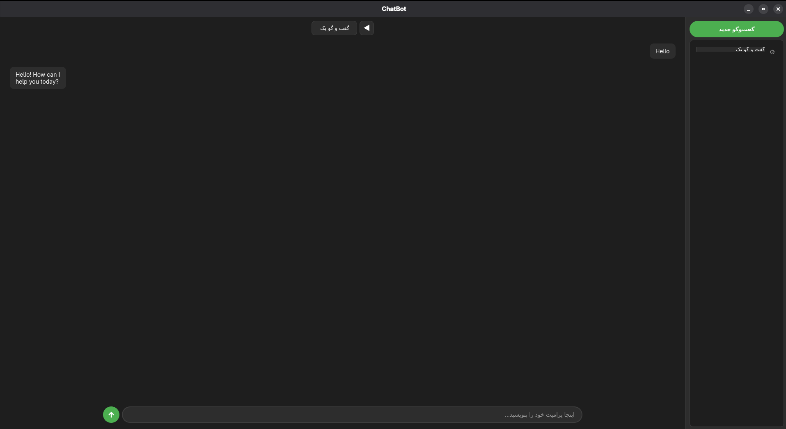

# PyQt6 Chatbot Interface

A modern PyQt6-based chatbot interface with LM Studio integration. Features include multi-chat management, typing animation effects, and a clean dark-themed UI.



## Features

- 🎨 Modern dark-themed user interface
- 💬 Multiple chat session management
- ⌨️ Real-time typing animation effects
- 💾 Automatic chat history saving
- ✏️ Chat renaming and deletion
- 🔄 Threaded API calls for responsive UI
- 🎯 Clean and intuitive design

## Requirements

- Python 3.8+
- PyQt6
- LM Studio (running locally)

## Installation

1. Clone the repository:
```bash
git clone https://github.com/yourusername/your-repo-name.git
cd your-repo-name

2. Install required dependencies:
bash
pip install PyQt6 requests

3. Make sure LM Studio is installed and running on `http://localhost:1234`

## Usage

1. Start LM Studio and load your preferred model

2. Run the application:
bash
python main.py

3. Start chatting:
   - Type your message in the input field at the bottom
   - Press Enter or click the Send button
   - Watch the AI response appear with typing animation

4. Manage your chats:
   - Click "New Chat" to start a fresh conversation
   - Click the gear icon (⚙) next to any chat to rename or delete it
   - Switch between chats by clicking on them in the sidebar

## Configuration

The application connects to LM Studio API at `http://localhost:1234/v1/chat/completions` by default. If your LM Studio runs on a different port, modify the `API_URL` in the code.

## File Structure

- `main.py` - Main application file
- `chats.json` - Automatically generated file storing chat history

## License

MIT License

## Contributing

Contributions are welcome! Feel free to open issues or submit pull requests.
